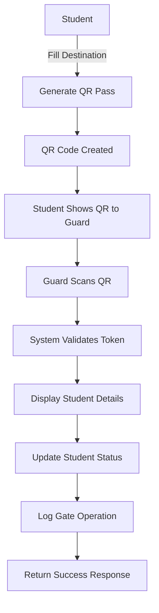

# 🚪 Gate In-Out System API Documentation

## Overview
The Gate In-Out System provides a QR-based solution for tracking student campus entry and exit. Students generate QR passes with their destination, and guards scan these passes to process gate operations.

## System Flow
1. **Student** fills destination and generates QR pass
2. **QR Code** contains student details and is valid for 10 minutes
3. **Guard** scans QR code at gate
4. **System** displays student details and processes entry/exit
5. **Student status** is updated (in/out) based on action

---

## 🔐 Authentication
All endpoints require appropriate authentication:
- **Student endpoints**: `auth` middleware
- **Guard endpoints**: `nonTeachingAuth` middleware  
- **Admin endpoints**: `adminAuth` middleware

---

## 📱 Student Endpoints

### 1. Generate QR Pass
**POST** `/api/gate/generate`

Generate a QR code for gate entry/exit.

**Request Body:**
```json
{
  "destination": "Library"
}
```

**Response:**
```json
{
  "success": true,
  "message": "Gate pass generated successfully",
  "data": {
    "gateLogId": "64f8a1b2c3d4e5f6a7b8c9d0",
    "qrCode": "data:image/png;base64,iVBORw0KGgoAAAANSUhEUgAA...",
    "action": "exit",
    "destination": "Library",
    "expiresAt": "2024-01-15T10:15:00.000Z",
    "validFor": "10 minutes",
    "studentInfo": {
      "name": "John Doe",
      "rollNumber": "2021CS001",
      "currentStatus": "in"
    }
  }
}
```

### 2. Get Current Status
**GET** `/api/gate/status`

Get student's current campus status.

**Response:**
```json
{
  "success": true,
  "message": "Current status retrieved successfully",
  "data": {
    "currentStatus": "in",
    "lastGateLog": {
      "id": "64f8a1b2c3d4e5f6a7b8c9d0",
      "action": "exit",
      "destination": "Library",
      "status": "processed",
      "issuedAt": "2024-01-15T10:05:00.000Z",
      "processedAt": "2024-01-15T10:07:00.000Z",
      "processedBy": {
        "name": "Guard Name",
        "staffId": "G001"
      }
    }
  }
}
```

### 3. Get Gate History
**GET** `/api/gate/my-logs`

Get student's gate log history.

**Query Parameters:**
- `page` (optional): Page number (default: 1)
- `limit` (optional): Items per page (default: 20)
- `action` (optional): Filter by action (exit/enter)
- `status` (optional): Filter by status (pending/processed/expired)

**Response:**
```json
{
  "success": true,
  "message": "Gate logs retrieved successfully",
  "data": {
    "logs": [
      {
        "id": "64f8a1b2c3d4e5f6a7b8c9d0",
        "action": "exit",
        "destination": "Library",
        "status": "processed",
        "issuedAt": "2024-01-15T10:05:00.000Z",
        "scannedAt": "2024-01-15T10:07:00.000Z",
        "scannedBy": {
          "name": "Guard Name",
          "staffId": "G001",
          "role": "Security Guard"
        }
      }
    ],
    "pagination": {
      "currentPage": 1,
      "totalPages": 5,
      "totalLogs": 100,
      "hasNext": true,
      "hasPrev": false
    }
  }
}
```

---

## 🛡️ Guard Endpoints

### 1. Scan QR Pass
**POST** `/api/gate/scan`

Scan and process a student's QR pass.

**Request Body:**
```json
{
  "token": "eyJhbGciOiJIUzI1NiIsInR5cCI6IkpXVCJ9...",
  "remarks": "Student verified successfully"
}
```

**Response:**
```json
{
  "success": true,
  "message": "Gate pass processed successfully",
  "data": {
    "student": {
      "id": "64f8a1b2c3d4e5f6a7b8c9d0",
      "name": "John Doe",
      "rollNumber": "2021CS001",
      "studentId": "2021CS001",
      "department": "Computer Science",
      "year": "3rd",
      "phone": "9876543210",
      "currentStatus": "out"
    },
    "gateLog": {
      "id": "64f8a1b2c3d4e5f6a7b8c9d0",
      "action": "exit",
      "destination": "Library",
      "processedAt": "2024-01-15T10:07:00.000Z",
      "processedBy": "Guard Name",
      "remarks": "Student verified successfully"
    }
  }
}
```

### 2. Get Active Students
**GET** `/api/gate/active`

Get all students currently on campus.

**Query Parameters:**
- `page` (optional): Page number (default: 1)
- `limit` (optional): Items per page (default: 50)
- `department` (optional): Filter by department
- `year` (optional): Filter by year

**Response:**
```json
{
  "success": true,
  "message": "Active students retrieved successfully",
  "data": {
    "students": [
      {
        "id": "64f8a1b2c3d4e5f6a7b8c9d0",
        "name": "John Doe",
        "rollNumber": "2021CS001",
        "studentId": "2021CS001",
        "department": "Computer Science",
        "year": "3rd",
        "phone": "9876543210",
        "currentStatus": "in",
        "lastGateLog": {
          "action": "enter",
          "destination": "Campus",
          "issuedAt": "2024-01-15T09:30:00.000Z"
        }
      }
    ],
    "pagination": {
      "currentPage": 1,
      "totalPages": 2,
      "totalStudents": 75,
      "hasNext": true,
      "hasPrev": false
    }
  }
}
```

---

## 👨‍💼 Admin Endpoints

### 1. Get All Gate Logs
**GET** `/api/gate/logs`

Get all gate logs with filtering options.

**Query Parameters:**
- `page` (optional): Page number (default: 1)
- `limit` (optional): Items per page (default: 20)
- `studentId` (optional): Filter by student ID
- `action` (optional): Filter by action (exit/enter)
- `status` (optional): Filter by status (pending/processed/expired)
- `startDate` (optional): Filter from date (YYYY-MM-DD)
- `endDate` (optional): Filter to date (YYYY-MM-DD)
- `department` (optional): Filter by department
- `year` (optional): Filter by year

**Response:**
```json
{
  "success": true,
  "message": "Gate logs retrieved successfully",
  "data": {
    "logs": [
      {
        "id": "64f8a1b2c3d4e5f6a7b8c9d0",
        "studentId": {
          "name": "John Doe",
          "rollNumber": "2021CS001",
          "studentId": "2021CS001",
          "department": "Computer Science",
          "year": "3rd"
        },
        "action": "exit",
        "destination": "Library",
        "status": "processed",
        "issuedAt": "2024-01-15T10:05:00.000Z",
        "scannedAt": "2024-01-15T10:07:00.000Z",
        "scannedBy": {
          "name": "Guard Name",
          "staffId": "G001",
          "role": "Security Guard"
        }
      }
    ],
    "pagination": {
      "currentPage": 1,
      "totalPages": 10,
      "totalLogs": 200,
      "hasNext": true,
      "hasPrev": false
    }
  }
}
```

### 2. Manual Gate Override
**POST** `/api/gate/manual-override`

Manually mark a student in/out (admin override).

**Request Body:**
```json
{
  "studentId": "64f8a1b2c3d4e5f6a7b8c9d0",
  "action": "exit",
  "destination": "Emergency",
  "remarks": "Emergency situation"
}
```

**Response:**
```json
{
  "success": true,
  "message": "Manual gate override successful",
  "data": {
    "student": {
      "id": "64f8a1b2c3d4e5f6a7b8c9d0",
      "name": "John Doe",
      "rollNumber": "2021CS001",
      "currentStatus": "out"
    },
    "gateLog": {
      "id": "64f8a1b2c3d4e5f6a7b8c9d0",
      "action": "exit",
      "destination": "Emergency",
      "processedBy": "Admin Name",
      "remarks": "Emergency situation"
    }
  }
}
```

---

## 🔧 Configuration

### Environment Variables
```env
QR_EXPIRE_MINUTES=10  # QR code validity in minutes
JWT_SECRET=your_jwt_secret
```

### QR Code Settings
- **Validity**: 10 minutes (configurable)
- **Size**: 300x300 pixels
- **Format**: PNG data URL
- **Content**: JWT token with student details

---

## 📊 Database Schema

### GateLog Collection
```javascript
{
  studentId: ObjectId,           // Reference to Student
  studentSnapshot: {
    name: String,
    rollNumber: String,
    studentId: String,
    phone: String,
    department: String,
    year: String
  },
  destination: String,           // Where student is going
  action: String,               // 'exit' or 'enter'
  status: String,               // 'pending', 'processed', 'expired'
  qrToken: String,              // JWT token for QR
  issuedAt: Date,               // When QR was generated
  expiresAt: Date,              // When QR expires
  scannedBy: ObjectId,          // Reference to NonTeachingStaff
  scannedAt: Date,              // When QR was scanned
  remarks: String               // Optional guard remarks
}
```

### Student Collection Updates
```javascript
{
  currentStatus: String,        // 'in' or 'out'
  lastGateLog: ObjectId        // Reference to latest GateLog
}
```

---

## 🚨 Error Handling

### Common Error Responses
```json
{
  "success": false,
  "message": "Error description",
  "errors": "Additional error details"
}
```

### Error Codes
- `400`: Bad Request (missing/invalid data)
- `401`: Unauthorized (invalid/missing token)
- `403`: Forbidden (insufficient permissions)
- `404`: Not Found (resource doesn't exist)
- `500`: Internal Server Error

---

## 🧪 Testing

### Test QR Generation
```bash
curl -X POST http://localhost:5000/api/gate/generate \
  -H "Authorization: Bearer YOUR_STUDENT_TOKEN" \
  -H "Content-Type: application/json" \
  -d '{"destination": "Library"}'
```

### Test QR Scanning
```bash
curl -X POST http://localhost:5000/api/gate/scan \
  -H "Authorization: Bearer YOUR_GUARD_TOKEN" \
  -H "Content-Type: application/json" \
  -d '{"token": "QR_JWT_TOKEN", "remarks": "Test scan"}'
```

---

## 📝 Notes

1. **QR Code Expiry**: QR codes expire after 10 minutes for security
2. **One Active Pass**: Students can only have one pending pass at a time
3. **Status Validation**: System prevents duplicate entry/exit actions
4. **Audit Trail**: All gate operations are logged with timestamps
5. **Guard Verification**: All gate passes must be scanned by guards
6. **Admin Override**: Admins can manually process gate operations
7. **Real-time Updates**: Student status updates immediately after scanning

---

## 🔄 System Workflow


